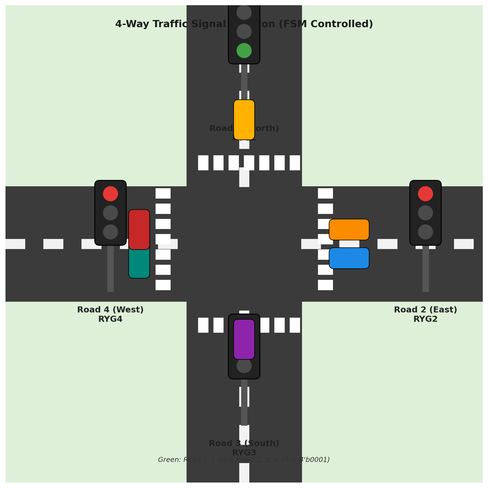
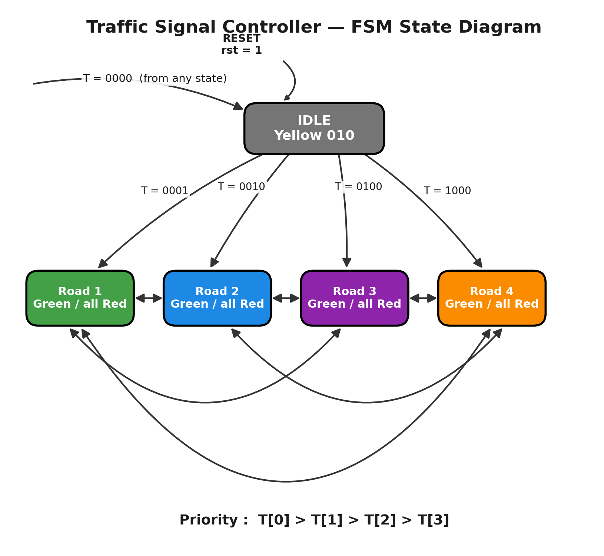

# 4-Way-Traffic-Signal-Controller-Verilog-FSM-
A 4-way traffic signal controller written in Verilog, simulated with Icarus Verilog + GTKWave and synthesized in Xilinx Vivado. Uses a priority-encoded input (T) to grant Green to one road at a time while the rest stay Red, with adjustable green-time via testbench delays.
 
# 🚦 4-Way Traffic Signal Controller (Verilog FSM)

A simple **Verilog-based traffic light controller** for a 4-road junction, built and simulated using **Icarus Verilog**, viewed on **GTKWave**, written in **VS Code**, and synthesized/schematic-checked in **Xilinx Vivado**.
  
The design takes a **priority-encoded input** and drives four independent Red-Yellow-Green (RYG) signals — one for each road — so that only **one road gets Green at a time**, while the rest stay Red 🔴.
 
--- 

## 📑 Table of Contents

- [How It Looks in Real Life](#-how-it-looks-in-real-life)
- [File Structure](#-file-structure)
- [How the Design Works](#-how-the-design-works)
  - [Module: `traficsignal`](#module-traficsignal)
  - [Signal Encoding](#-signal-encoding)
  - [Logic Flow](#-logic-flow-on-every-posedge-clk)
  - [FSM State Diagram](#-fsm-state-diagram)
  - [Important: One Road at a Time!](#-important-one-road-at-a-time)
- [Testbench: `traficsignal_tb`](#-testbench-traficsignal_tb)
  - [Giving a Road More Green Time](#-giving-a-road-more-green-time)
- [Tools Used](#-tools-used)
- [How to Run the Simulation](#-how-to-run-the-simulation-icarus-verilog--gtkwave)
  - [Install Icarus Verilog & GTKWave](#1-install-icarus-verilog--gtkwave)
  - [Compile the Design + Testbench](#2-compile-the-design--testbench)
  - [Run the Simulation](#3-run-the-simulation)
  - [View the Waveform in GTKWave](#4-view-the-waveform-in-gtkwave)
- [How to Use in Xilinx Vivado](#-how-to-use-in-xilinx-vivado-for-schematic)
- [How to Use in VS Code](#-how-to-use-in-vs-code)
- [Possible Improvements](#-possible-improvements)
- [License](#-license)

---

## 🖼️ How It Looks in Real Life

<p align="center">
  
</p>

<p align="center"><i>Example: Road 1 (North) is Green while Roads 2, 3 and 4 stay Red — exactly how the FSM behaves when <code>T = 4'b0001</code>.</i></p>

---

## 📁 File Structure

| File / Folder | Description |
|---|---|
| `traficsignal.v` | Main Verilog design module — the traffic signal FSM logic |
| `traficsignal_tb.v` | Testbench that drives clock, reset, and `T` inputs to simulate the design |
| `intersection.png` | Illustration of the real-life 4-way junction (this README banner) |
| `fsm_diagram.png` | FSM state diagram showing states and transitions of the design |
| `schematic.png` | RTL schematic generated from **Xilinx Vivado** after synthesis |
| `iowave.png` | Simulation waveform screenshot captured from **GTKWave** |
| `console.png` | Screenshot of the `$monitor` console output from running the simulation |
| `dump.vcd` | Value Change Dump file generated by Icarus Verilog, opened in GTKWave |

> 📝 **Note:** `schematic.png`, `iowave.png`, `console.png`, and `dump.vcd` are generated *after* you run synthesis/simulation on your machine (steps below). Add them to the repo once you generate them, and they'll render right here in this table/README.

---

## ⚙️ How the Design Works

### Module: `traficsignal`

```verilog
module traficsignal(RYG1, RYG2, RYG3, RYG4, T, rst, clk);
```

| Port | Direction | Width | Purpose |
|---|---|---|---|
| `clk` | input | 1 bit | System clock |
| `rst` | input | 1 bit | Synchronous reset (active high) |
| `T` | input | 4 bits | Road request input, **one bit per road** |
| `RYG1` | output reg | 3 bits | Signal state for Road 1 |
| `RYG2` | output reg | 3 bits | Signal state for Road 2 |
| `RYG3` | output reg | 3 bits | Signal state for Road 3 |
| `RYG4` | output reg | 3 bits | Signal state for Road 4 |

### 🎨 Signal Encoding

Each `RYG` output is a 3-bit code representing the light state:

| Code | Meaning |
|---|---|
| `3'b100` | 🔴 Red |
| `3'b010` | 🟡 Yellow (used only on reset / idle) |
| `3'b001` | 🟢 Green |

### 🧠 Logic Flow (on every `posedge clk`)

1. **`rst = 1`** → All four roads are forced to `3'b010` (Yellow / safe idle state). This is the default power-up / reset condition.
2. **`rst = 0` and `T = 4'b0000`** → No road has requested green, so all lights stay in the idle Yellow state.
3. **`rst = 0` and `T != 0`** → The FSM checks `T` **bit by bit, in priority order** (`T[0]` → `T[1]` → `T[2]` → `T[3]`):
   - `T[0] = 1` → **Road 1 = Green**, Roads 2/3/4 = Red
   - `T[1] = 1` → **Road 2 = Green**, Roads 1/3/4 = Red
   - `T[2] = 1` → **Road 3 = Green**, Roads 1/2/4 = Red
   - `T[3] = 1` → **Road 4 = Green**, Roads 1/2/3 = Red
4. If none of the bits match (shouldn't normally happen since `T != 0` was already checked), all outputs **hold their previous value**.

### 🔀 FSM State Diagram

<p align="center">
  
</p>

There are **5 states**: `IDLE` and one `ROADx_GREEN` state per road. `rst = 1` forces the FSM back to `IDLE` from any state, and `T = 0000` from any state also returns it to `IDLE`. From `IDLE`, the first set bit in `T` (checked in priority order `T[0] > T[1] > T[2] > T[3]`) moves the FSM directly into that road's Green state. All four road states are also **directly connected to each other** — from any road's Green state, whichever `T` bit is asserted next takes the FSM straight to that road, without passing back through `IDLE`.

### 🚨 Important: One Road at a Time!

The design is written as a **priority `if-else` chain**, meaning it only ever grants Green to **one road per clock cycle** — even if you set multiple bits of `T` high together (e.g. `T = 4'b0011`), only the **lowest priority bit that's set** (Road 1 in that example) will get Green.

➡️ **When testing, always assert `T` one road at a time** (e.g. `4'b0001`, then `4'b0010`, etc.), one after another — not simultaneously — so each road correctly gets its turn at Green. This is exactly what the provided testbench does.

---

## 🧪 Testbench: `traficsignal_tb`

The testbench:
1. Initializes `clk = 0` and `rst = 0`.
2. Toggles the clock every `5` time units (`always #5 clk = ~clk;` → 10 time-unit clock period).
3. Dumps all signals to `dump.vcd` for waveform viewing.
4. Uses `$monitor` to print every signal change to the console in real time.
5. Applies the following input sequence:

```verilog
rst = 1'b1 ; #10;                 // Reset all roads to Yellow
rst = 1'b0 ; T = 4'b0001 ; #10;   // Road 1 → Green
              T = 4'b0000 ; #10;   // All idle (Yellow)
              T = 4'b0010 ; #10;   // Road 2 → Green
              T = 4'b0100 ; #10;   // Road 3 → Green
              T = 4'b1000 ; #10;   // Road 4 → Green
$finish;
```

### ⏱️ Giving a Road More Green Time

Each `#10` is just a **delay in simulation time units** before the next input is applied. If a particular road needs to stay Green **longer** (e.g. it's a busier road), simply **increase the `#delay` value** after setting that road's `T` bit:

```verilog
T = 4'b0001 ; #40;   // Road 1 stays Green for 40 time units instead of 10
T = 4'b0010 ; #10;   // Road 2 gets the normal 10 time units
```

You can independently tune the delay for every road this way — no changes to the main design (`traficsignal.v`) are needed, only the testbench timing.

---

## 🛠️ Tools Used

| Tool | Purpose |
|---|---|
| 🖊️ **VS Code** | Writing and editing the Verilog source (`.v`) files |
| ⚡ **Icarus Verilog (`iverilog`)** | Compiling and simulating the Verilog design + testbench |
| 📈 **GTKWave** | Viewing the `dump.vcd` waveform generated by the simulation |
| 🧩 **Xilinx Vivado** | Synthesizing the design and generating the RTL schematic (`schematic.png`) |

---

## ▶️ How to Run the Simulation (Icarus Verilog + GTKWave)

### 1️⃣ Install Icarus Verilog & GTKWave

- **Windows:** Download and install from [Icarus Verilog for Windows](http://bleyer.org/icarus/) — GTKWave is usually bundled with it.
- **Linux (Debian/Ubuntu):**
  ```bash
  sudo apt update
  sudo apt install iverilog gtkwave
  ```
- **macOS (Homebrew):**
  ```bash
  brew install icarus-verilog gtkwave
  ```

### 2️⃣ Compile the Design + Testbench

Open a terminal (or the VS Code integrated terminal) in the project folder:

```bash
iverilog -o traficsignal_tb.out traficsignal.v traficsignal_tb.v
```

### 3️⃣ Run the Simulation

```bash
vvp traficsignal_tb.out
```

This prints the live `$monitor` output to your terminal **and** generates `dump.vcd`.

> ⏱️ Exact timestamps depend on the clock edge alignment — check your real `dump.vcd`/console output. You can take a screenshot of this terminal output and save it as `console.png` in this repo so it shows up in the file table above.

### 4️⃣ View the Waveform in GTKWave

```bash
gtkwave dump.vcd
```

- In GTKWave, drag `clk`, `rst`, `T`, `RYG1`, `RYG2`, `RYG3`, `RYG4` from the signal list into the waveform viewer.
- Take a screenshot of the waveform and save it as `iowave.png` in this repo so it shows up in the file table above.

---

## 🧩 How to Use in Xilinx Vivado (for Schematic)

1. Open **Vivado** → **Create New Project**.
2. Add `traficsignal.v` as a **Design Source**.
3. Add `traficsignal_tb.v` as a **Simulation Source** (optional, for Vivado's own simulator).
4. Run **RTL Analysis → Open Elaborated Design** to view the schematic.
5. Right-click the schematic view → **Save Schematic as PNG/PDF** → save it as `schematic.png` in this repo.
6. (Optional) Run **Synthesis** and **Implementation** if you want to generate a bitstream for an actual FPGA board.

---

## 🖥️ How to Use in VS Code

1. Install the **Verilog-HDL/SystemVerilog** extension (by `mshr-h` or `leafvmaple`) for syntax highlighting.
2. Open this repo folder in VS Code: `File → Open Folder`.
3. Use the integrated terminal (`` Ctrl+` ``) to run the `iverilog` / `vvp` / `gtkwave` commands shown above — no need to leave the editor.

---

## 🚀 Possible Improvements

- Add a **counter-based timer** instead of relying only on testbench delays, so timing is controlled inside the hardware itself.

---

## 📜 License

Feel free to use, modify, and learn from this project. Attribution appreciated but not required. 🙌

---

<p align="center">Made with 🚦 + Verilog + a lot of <code>#delay</code> tuning</p>

